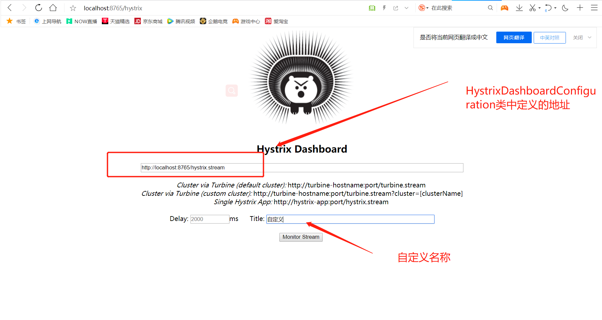

# oh-spring-cloud-demo
spring-cloud 整体微服务demo

基础组件包含：服务注册与发现、服务消费、负载均衡、熔断器、智能路由、配置管理


# 统一依赖管理(spring-cloud-dependencies)
# 服务注册与发现(spring-cloud-eureka)
# 服务提供(spring-cloud-service-provider)
# 服务消费(spring-cloud-service-consumer-fegin)
# 熔断监控(spring-cloud-hystrix)
# 熔断监控可视化

1. 添加入口类@EnableHystrixDashboard 注解
2. 添加依赖
```$xslt
<dependency>
    <groupId>org.springframework.cloud</groupId>
    <artifactId>spring-cloud-starter-netflix-hystrix-dashboard</artifactId>
</dependency>
```
3. 添加配置类HystrixDashboardConfiguration

4. web地址 http://localhost:8765/hystrix


# 路由网关统一访问


# 服务链路追踪(spring-cloud-zipkin)
## 服务端
可使用docker 搭建服务端
```$xslt
docker run -d -p 9411:9411 openzipkin/zipkin
```

## 客户端

1. 添加依赖

```$xslt
<!--链路追踪-->
<dependency>
    <groupId>org.springframework.cloud</groupId>
    <artifactId>spring-cloud-starter-zipkin</artifactId>
</dependency>
```
2. 配置
```$xslt
spring:
  zipkin:
    base-url: http://192.168.137.101:9411
```


# 服务监控(spring-cloud-service-admin)


